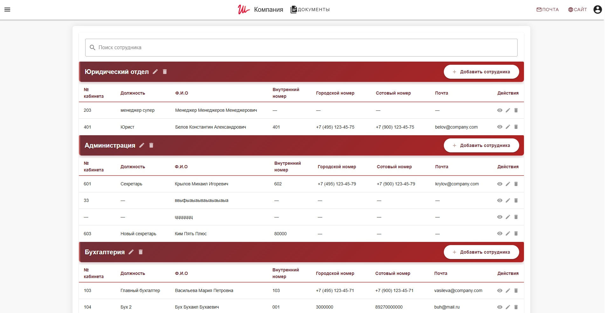
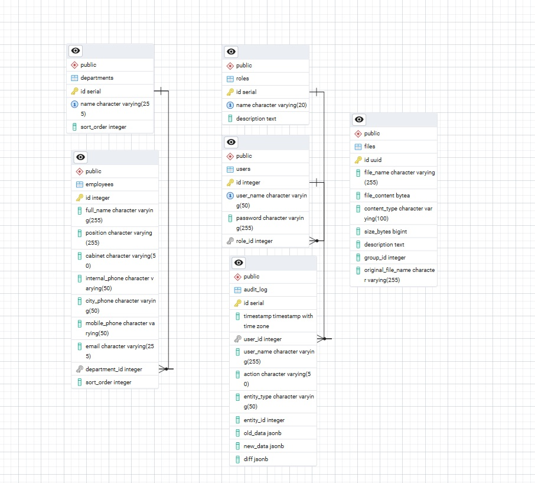

# Phonebook
**Phonebook** - это полнофункциональное веб-приложение для управления контактами сотрудников организации. Проект построен на современном стеке технологий и предоставляет удобный интерфейс для работы с организационной структурой компании.

## Скриншоты

### Интерфейс приложения

### Схема базы данных

## Демонстрация

## Ключевые особенности

- Создание, редактирование, удаление отделов и сотрудников.
- Загрузка и скачивание файлов (документы, инструкции).
- Настройка приоритета сортировки.
- Быстрый поиск и подсветка найденных совпадений.
- Фильтрация сотрудников по отделам.
- Аутентификация с JWT-токенами.
- Разделением ролей (администратор / редактор).
- Аудит действий пользователей (логирование операций).
- Валидация на фронтенде и бэкенде.

## Технологический стек

### Frontend
- Vue 3 (Composition API)
- TypeScript
- Pinia
- Vuelidate
- Vuetify 3

### Backend
- Node,
- NestJS,
- Prisma ORM,
- PostgreSQL,
- Bcrypt,
- Multer,
- JWT,
- Class-validator,
- REST API