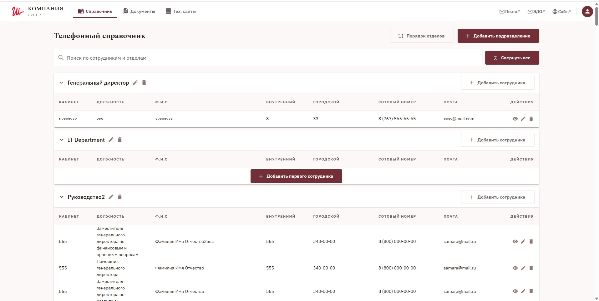
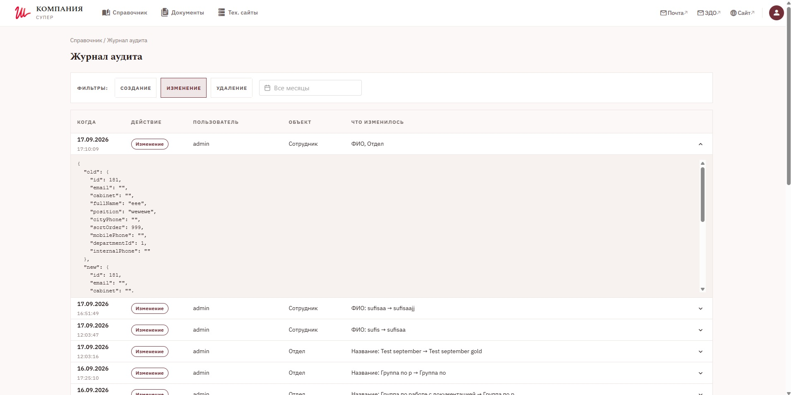
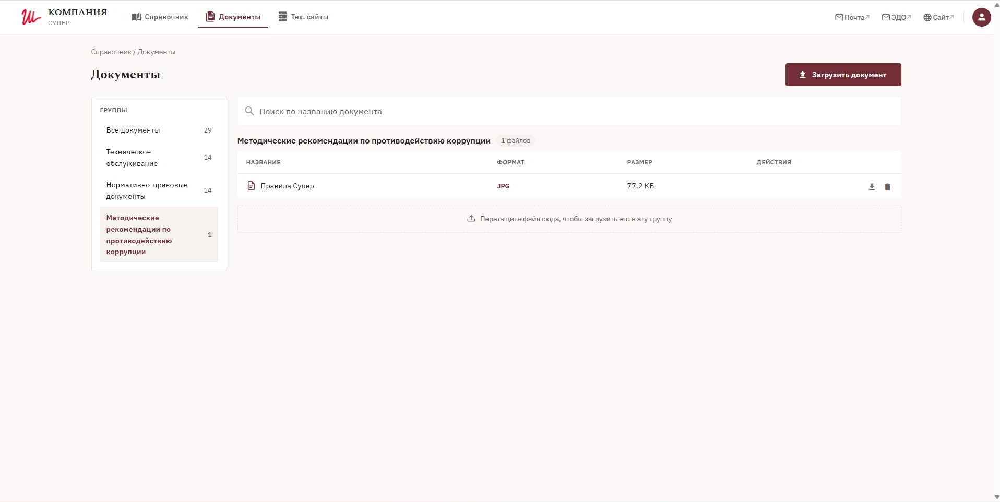
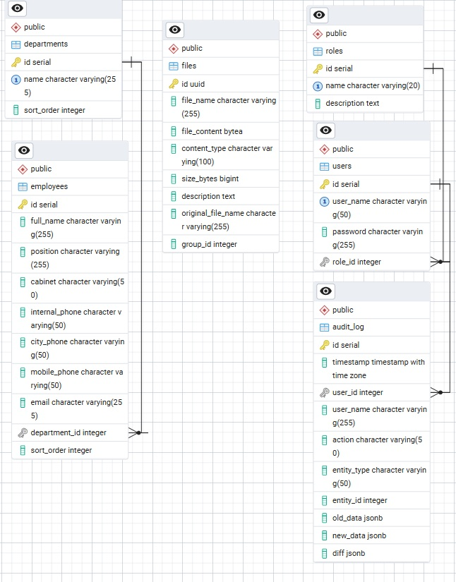
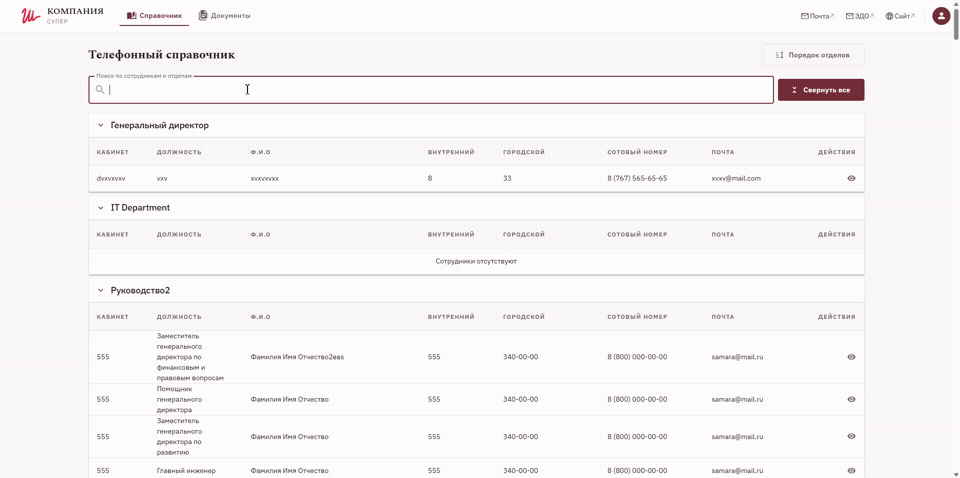

# Phonebook

**Phonebook** - веб-приложение для управления корпоративным телефонным справочником. В нём хранятся контакты сотрудников по отделам, документы и ссылки на технические ресурсы. Просматривать справочник могут все, а изменять данные только авторизованные пользователи. Все изменения сотрудников, отделов и файлов записываются в журнал аудита.

Проект развивался поэтапно: интерфейс был переработан, а бэкенд мигрирован с Express на NestJS и получил Prisma ORM.

## Скриншоты

### Справочник сотрудников

### Журнал аудита

### Документы

### Схема базы данных

## Демонстрация

## Возможности

**Справочник**
- Создание, редактирование и удаление отделов и сотрудников.
- Быстрый поиск с подсветкой совпадений.
- Настройка порядка отображения через drag-and-drop.
- Сворачиваемые отделы.

**Документы и ресурсы**
- Загрузка и скачивание файлов (документы, инструкции).
- Раздел со ссылками на технические сайты.

**Журнал аудита**
- Записывается действие (создание, изменение, удаление), пользователь, объект (сотрудник, отдел, файл), время.
- Для изменений хранятся старые и новые данные и разница между ними (diff).
- Серверная пагинация и фильтры по типу действия и месяцу.

**Безопасность и администрирование**
- Аутентификация по JWT, пароли хранятся в виде хэшей (bcrypt).
- Роли (администратор / редактор) и защита маршрутов на клиенте и сервере.
- Валидация данных на клиенте (Vuelidate) и на сервере (class-validator).

## Технологический стек

**Frontend:** Vue 3 (Composition API), TypeScript, Vite, Pinia, Vue Router, Vuetify 3, Vuelidate, Axios, vuedraggable, VueDatePicker

**Backend:** Node.js, NestJS, Prisma ORM, PostgreSQL, JWT, bcrypt, Multer, class-validator, REST API

## Миграция с Express на NestJS

Первая версия бэкенда была написана на Express с прямыми запросами к PostgreSQL через `pg`. Позже я перенёсла её на NestJS с Prisma.

| | Было (`server/`) | Стало (`server-new/`) |
|---|---|---|
| Фреймворк | Express 5 | NestJS 11 |
| Работа с БД | `pg`, SQL-запросы вручную | Prisma ORM, типизированные модели |
| Валидация | `express-validator` | DTO + `class-validator` |
| Авторизация | Middleware (`authenticateToken`) | Guards |
| Структура | Контроллеры, сервисы, модели по слоям | Модули по доменам (auth, users, roles, departments, employees, files, audit) |

Что дала миграция:
- Типобезопасный доступ к данным и схема БД, описанная в одном файле (`schema.prisma`).
- Модульная структура и встроенное внедрение зависимостей.
- Единый TypeScript-стек с фронтендом.

Папка `server/` оставлена как архив прежней реализации. Актуальный бэкенд находится в `server-new/`.

## Структура проекта
- `client/` — SPA на Vue 3
- `server-new/` — актуальный REST API (NestJS + Prisma)
- `server/` — прежняя версия API (Express), для истории